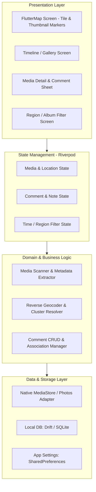
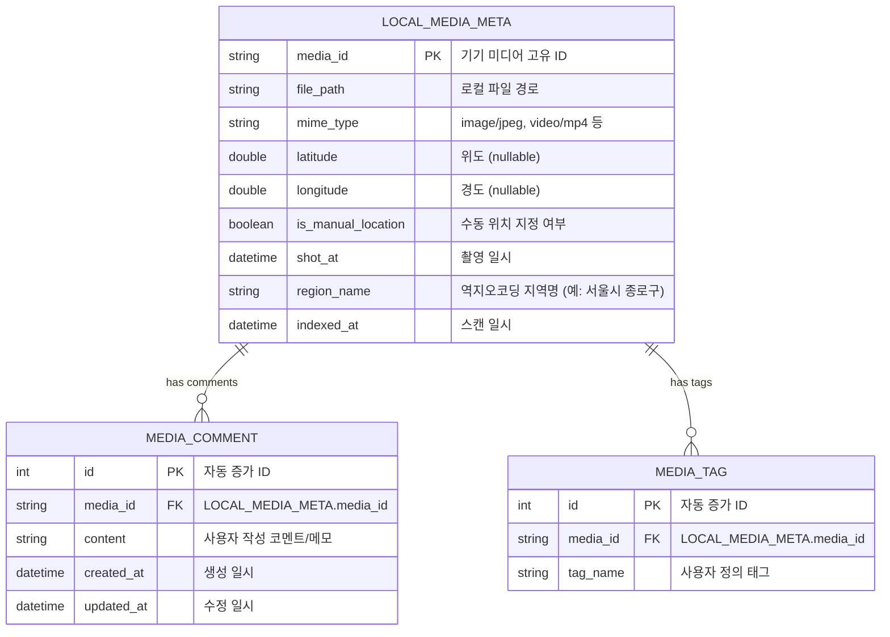

# 📐 System Architecture

이 문서는 **Travler** 애플리케이션의 시스템 구조, 데이터 파이프라인, 레이어별 책임 및 로컬 데이터베이스 설계를 정의합니다.

---

## 1. 아키텍처 원칙 (Core Principles)

1. **Local-First & Zero-Upload**: 미디어 원본 파일이나 사용자 메타데이터를 외부 서버에 업로드하지 않고 기기 내부에서만 처리합니다.
2. **Layered & Feature-Driven**: UI, 상태 관리, 비즈니스 로직, 데이터 접근 계층을 명확히 분리하여 유지보수성을 확보합니다.
3. **Pure Flutter Widget Map Canvas**: `flutter_map (OpenStreetMap)`을 채택하여 API 키 제약 없이 사진 썸네일 위젯 마커를 부드럽게 렌더링하고 오프라인 캐싱을 지원합니다.
4. **Reactive State Management**: Riverpod을 활용한 단방향 데이터 흐름 및 비동기 상태의 선언적 관리.

---

## 2. 전체 시스템 구조

---

## 3. 계층별 세부 역할

### 3.1 Presentation Layer (UI)
- **Map View (`flutter_map`)**:
  - OpenStreetMap 타일 레이어 기반 지도 렌더링 (API Key 불필요).
  - 사진 썸네일 원형 배지(Custom Flutter Widget)를 마커로 직접 표출.
  - 마커 선택 시 해당 위치의 미디어 캐러셀 및 코멘트 요약 바텀시트 표출.
- **Gallery / Timeline View**:
  - 일자별(연/월/일) 그리드 뷰 및 지역별 묶음 뷰.
  - 위치 미지정(No-GPS) 미디어 필터 탭 제공.
- **Media Detail & Viewer**:
  - 고해상도 사진 줌/팬 뷰어 및 비디오 플레이어.
  - 코멘트 작성, 수정, 태그 관리 모달.

### 3.2 State Management Layer (`flutter_riverpod`)
- 상태의 불변성(Immutability) 유지 및 비동기 스트림/Future 통합 관리.
- 화면 회전, 라이프사이클 변화 시 로컬 인덱싱 데이터 캐시 유지.

### 3.3 Domain Layer
- **Media Scanner**:
  - 기기 저장소에서 신규/수정된 미디어 감지 (`photo_manager`).
  - EXIF 메타데이터(위도, 경도, 촬영일시, 방위각 등) 파싱.
- **Reverse Geocoding Service**:
  - 위경도 좌표 기반 행정구역(국가, 시/도, 구/군, 동/읍/면) 매핑 및 로컬 캐싱.
- **Comment Service**:
  - 기기 내 고유 Media ID와 사용자 작성 메모/코멘트 간의 무결성 관리.

### 3.4 Data & Storage Layer
- **Photo Manager Plugin**: 플랫폼 네이티브 MediaStore(Android) 및 PhotoKit(iOS) 연동.
- **Local DB (`Drift` / SQLite)**:
  - 사용자 코멘트, 즐겨찾기, 수동 위치 보정 데이터, 역지오코딩 캐시 저장.

---

## 4. 로컬 데이터베이스 ERD (Drift / SQLite)

