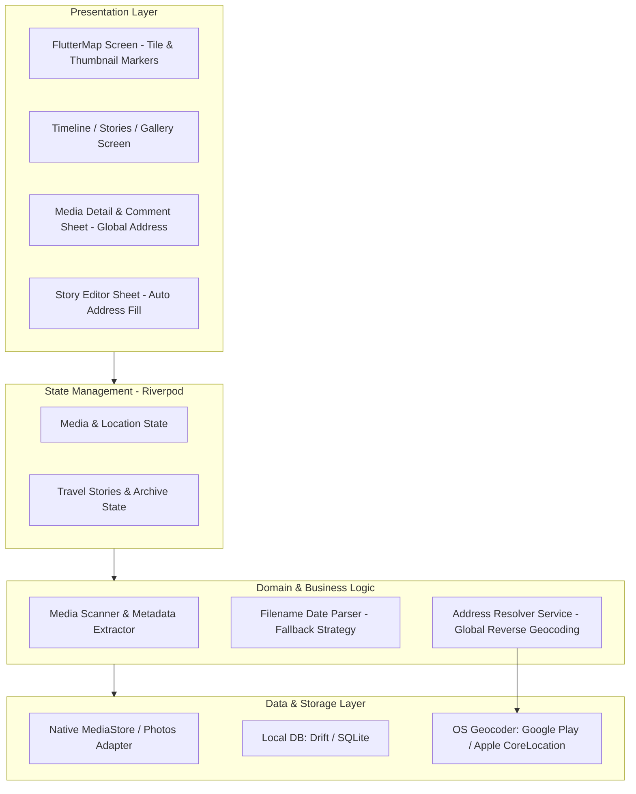

# 📐 System Architecture

이 문서는 **Travler** 애플리케이션의 시스템 구조, 데이터 파이프라인, 레이어별 책임 및 로컬 데이터베이스 설계를 정의합니다.

---

## 1. 아키텍처 원칙 (Core Principles)

1. **Local-First & Zero-Upload**: 미디어 원본 파일이나 사용자 메타데이터를 외부 서버에 업로드하지 않고 기기 내부에서만 처리합니다.
2. **Layered & Feature-Driven**: UI, 상태 관리, 비즈니스 로직, 데이터 접근 계층을 명확히 분리하여 유지보수성을 확보합니다.
3. **Pure Flutter Widget Map Canvas**: `flutter_map (OpenStreetMap)`을 채택하여 API 키 제약 없이 사진 썸네일 위젯 마커를 부드럽게 렌더링하고 오프라인 캐싱을 지원합니다.
4. **Multi-Layered Metadata Fallback**: EXIF 손상, 메신저 다운로드 등으로 일시나 위치가 왜곡된 경우 파일명 정규식 타임스탬프 분석 및 사용자 수동 보정 UI를 통한 4단계 방어 전략을 구축합니다.
5. **Global Reverse Geocoding with Smart Caching**: 네이티브 Geocoder를 활용하여 전 세계(한국/해외) 좌표를 실제 도로명 주소로 변환하며, 약 100m 단위 인메모리 캐싱으로 배터리와 통신 자원을 절감합니다.
6. **Reactive State Management**: Riverpod을 활용한 단방향 데이터 흐름 및 비동기 상태의 선언적 관리.

---

## 2. 전체 시스템 구조

---

## 3. 계층별 세부 역할

### 3.1 Presentation Layer (UI)
- **Map View (`flutter_map`)**:
  - OpenStreetMap 타일 레이어 기반 지도 렌더링 (API Key 불필요).
  - 사진 썸네일 원형 배지(Custom Flutter Widget)를 마커로 직접 표출.
  - 마커 선택 시 해당 위치의 미디어 캐러셀 및 코멘트 요약 바텀시트 표출.
- **Media Detail Sheet (`MediaDetailSheet`)**:
  - 고해상도 사진 줌/팬 뷰어 및 비디오 플레이어 연동.
  - **글로벌 도로명 주소 실시간 변환 표출** (예: "제주시 애월읍", "Tokyo, Minato City").
  - 코멘트 작성, 인라인 수정, 단건 삭제 모달.
  - SafeArea 기반 하단 소프트키/제스처 바 가림 완벽 방지.
- **Story Editor Sheet (`StoryEditorSheet`)**:
  - 선별된 사진/동영상 기반 독립된 여행 아카이브 생성.
  - **좌표 기반 도로명 주소 장소명 자동 채우기 (`_autoFillAddress`)**.
  - 수동 위치 지도 핀 피커 (`LocationPickerScreen`) 연동.

### 3.2 Domain Layer & Fallback 파이프라인
- **다계층 촬영 일시 복원 (Date Fallback Pipeline)**:
  1. 1차: MediaStore `createDateTime` 취득.
  2. 2차: 카카오톡/다운로드 파일명 정규식 분석 (`FilenameDateParser`). 시스템 일시와 24시간 이상 차이 시 파일명 실제 촬영일로 자동 복원.
  3. 3차: 사용자 수동 일시 수정 기능 지원.
- **글로벌 역지오코딩 (`AddressResolverService`)**:
  - OS Geocoder API를 호출하여 한국(행정동/도로명) 및 전 세계(거리/도시/주/국가) 표준 주소 변환.
  - 반경 100m 단위(소수점 3자리) 인메모리 캐싱으로 네트워크/시스템 오버헤드 최소화.
  - 오프라인 시 위경도 좌표로 안전한 자동 Fallback.

### 3.3 Data & Storage Layer
- **Local DB (`Drift` / SQLite)**:
  - `TravelStories`: 독립된 여행 아카이브 (제목, 장소, 동행인, 일기, 날짜, 좌표).
  - `StoryMedia`: 스토리와 미디어 매핑 (대표 커버 사진 지정).
  - `MediaComments`: 사진/영상별 사용자 메모 및 코멘트.
  - `ManualLocations`: 사용자가 수동 보정한 좌표 영구 저장.
  - `HiddenMedia`: 사용자가 숨긴 사진 ID 목록.
