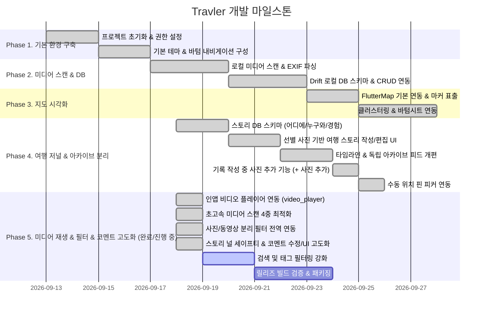

# 🚀 Development Roadmap

이 문서는 **Travler** 애플리케이션의 단계별 구현 계획, 마일스톤 및 각 단계의 완료 검증 기준을 정의합니다.

---

## 📅 단계별 마일스톤 (Milestones)

---

## 🎯 세부 작업 내역 & 검증 기준

### 📍 Phase 1: 기반 환경 구성 (Foundation) [완료]
- **작업 내용**:
  - Flutter 3.x 프로젝트 초기화 및 기본 패키지 종속성(`flutter_riverpod`, `photo_manager`, `flutter_map`, `drift` 등) 구성.
  - Android (`AndroidManifest.xml`) 및 iOS 권한 설정 (미디어 읽기 권한, 정밀 위치 권한).
  - Material 3 기반 기본 테마 및 하단 바텀 내비게이션 바(지도 탭, 타임라인 탭, 설정 탭) 구성.

---

### 📍 Phase 2: 로컬 미디어 스캔 & 로컬 DB 구축 (Data Core) [완료]
- **작업 내용**:
  - `photo_manager`를 이용한 백그라운드 미디어(사진/동영상) 인덱싱 파이프라인 구현.
  - GPS 위경도, 촬영 일시(`DateTime`), 미디어 타입 메타데이터 추출.
  - `Drift (SQLite)` 기반 로컬 DB 스키마 정의 (`MediaComments`, `ManualLocations`, `HiddenMedia`).

---

### 📍 Phase 3: 지도 시각화 & 클러스터링 (Map Visualization) [완료]
- **작업 내용**:
  - OpenStreetMap (`flutter_map`) 기반 지도 렌더링.
  - 사진 썸네일 원형 마커 및 근접 마커 클러스터링(Clustering) 구현.
  - 마커 탭 시 사진/동영상 리스트 바텀시트(Carousel) 및 코멘트 작성 연동.
  - 동영상/특수 포맷 디코딩 예외 방어 로직 적용.

---

### 📍 Phase 4: 여행 저널 & 아카이브 독립 관리 (Journal & Story Organization) [완료]
- **핵심 목표**:
  - 기기 전체 사진을 무작정 섞는 것이 아니라, **지도는 원래의 기기 사진 마커를 깔끔하게 표출**하고, 사용자가 **[어디서] + [누구와] + [어떤 경험을] + [원하는 사진들]**을 선별하여 **독립된 여행 아카이브**로 관리.
- **세부 구현 내용**:
  1. **로컬 DB 확장 (`AppDatabase`)**:
     - `TravelStories` 테이블 (`title`, `placeName`, `companions`, `content`, `eventDate`, `latitude`, `longitude`, `createdAt`)
     - `StoryMedia` 테이블 (`storyId`, `mediaId`, `isCover`)
  2. **여행 스토리 작성/편집 UI (`StoryEditorSheet`)**:
     - **[+ 사진/영상 추가] 기능**: 지도 마커나 갤러리에서 진입한 뒤에도 기기 갤러리에서 추가 미디어를 자유롭게 여러 장 선택 가능.
     - 여행 일자, 장소(장소명/지도 핀 피커), 동행인(태그 칩: 가족, 연인, 친구, 혼자, 반려동물), 여행 일기/메모 입력 지원.
  3. **타임라인 화면 개편 (`TimelineScreen`)**:
     - **[나의 여행 발자국] 탭**: 동행인 필터 칩과 함께 카드형 피드로 독립된 아카이브 관리.
     - **[기기 갤러리] 탭**: 사진들을 다중 선택하여 바로 새 아카이브를 만들 수 있는 모드 제공.
  4. **지도 마커와 아카이브 분리 (`MapScreen`)**:
     - 지도는 기기 내 GPS 사진 마커 클러스터링에 집중.
     - 마커 터치 시 바텀시트에서 **[이 사진으로 여행 기록 만들기]** 원클릭 연동.
  5. **수동 위치 지정 피커 (`LocationPickerScreen`)**:
     - GPS 정보가 없거나 위치를 수정하고 싶을 때 지도에서 핀을 조작하여 좌표 확정.

---

### 📍 Phase 5: 미디어 재생 & 필터 & 코멘트 고도화 (Media Player, Filter & Polish) [진행 중]
- **세부 작업 내용**:
  1. **인앱 비디오 플레이어 (`VideoPlayerWidget` & `video_player`) [완료]**:
     - 미디어 풀뷰어(`MediaFullViewer`) 내에서 동영상 항목 선택 시 실제 재생/일시정지, 프로그레스 바, 재생 시간 표시 지원.
  2. **초고속 미디어 스캔 4중 최적화 [완료]**:
     - N+1 SQLite 쿼리 제거 (단 2회의 DB 쿼리로 인메모리 O(1) 매핑).
     - 동기식 MediaStore 좌표 우선 활용 (무거운 비동기 채널 호출 생략).
     - 25개 단위 병렬 비동기 청크 처리 (`Future.wait`).
     - 2단계 점진적 로딩 (첫 화면 80장 0.2초 이내 즉각 표출 후 백그라운드 잔여 병합).
  3. **사진 / 동영상 분리 필터 전역 연동 [완료]**:
     - **지도 화면 (`MapScreen`)**: 상단에 `[전체]`, `[📷 사진만]`, `[🎬 동영상만]` 플로팅 필터 칩 제공 (개수 배지 실시간 연동).
     - **타임라인 기기 갤러리 (`TimelineScreen`)**: `[전체]`, `[사진]`, `[동영상]` 탭 필터 칩 및 영상 썸네일 재생 시간(듀레이션) 배지 표출.
     - **스토리 작성 모달 (`StoryEditorSheet`)**: [+ 사진/영상 추가] 모달 내에서도 타입별 분리 선택 지원.
  4. **스토리 널 세이프티 & 코멘트 수정/UI 고도화 [완료]**:
     - 여행 발자국 로드 시 `type 'Null' is not a subtype of type 'MediaItem'` 타입 에러 완벽 해결 (안전한 미디어 fallback 제공).
     - 바텀시트 하단 코멘트 입력창에 `SafeArea(top: false)` 적용하여 스마트폰 하단 소프트키/제스처 바 가림 해결.
     - 미디어 코멘트(메모) 수정 다이얼로그 및 단건 삭제 기능 연동 (`AppDatabase` + `media_provider`).
  5. **검색 및 태그 필터링 강화 [진행 예정]**:
     - 여행 기록 제목, 장소명, 동행인, 메모 내용 실시간 검색.
  6. **릴리즈 빌드 검증 & 패키징**:
     - APK / 번들 빌드 검증 및 릴리즈 준비.
